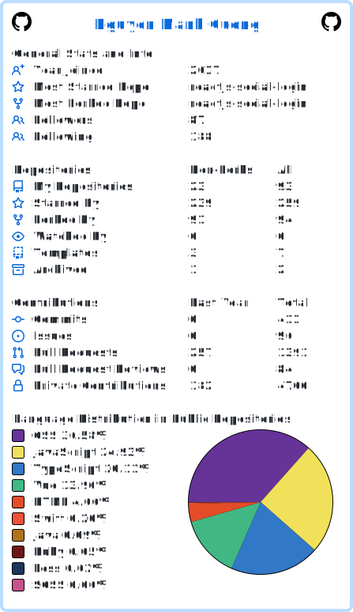

<h1 align="center">Hi 👋, I'm Nguyễn Mạnh Cường</h1>
<h3 align="center">A passionate JavaScript developer from VietNam :)</h3>

### Skills 

 

###  👨🏻‍💻 About Me 
- 🔭 I’m currently working on **Panoee - Platform For Virtual Tour 360 Free**
- 💬 More info about my product: https://panoee.com
- 💬 Ask me about **ReactJS, VueJS, NodeJS and about JavaScript**
- 📫 How to reach me **nguyenmanhcuong.stf@gmail.com**

 

<h3 align="center"> 🤝🏻 Connect with Me </h3>

- 
- 
- 
- 
- 
- 
- 
- 
- 

